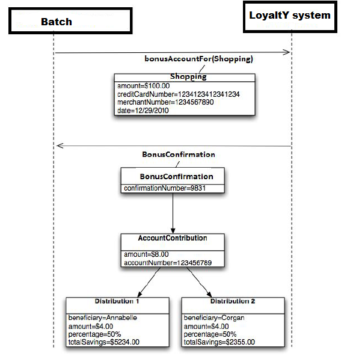
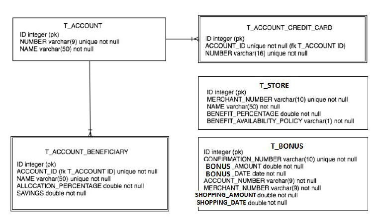

<h1 align="center">
   
  Spring Boot LoyaltY sample system
   
</h1>

<h4 align="center">Shopping reword management</h4>

    
    
    
          
    
     

## Table of Contents ##
1. [Domain Overview](#overview)
2. [Loyalty applications](#loyalty)
3. [Database Schema](#Database-Schema)
4. [Technology](#Technology)

## Domain Overview ##
The Domain is called loyalty Shopping. The idea behind it is that customers can save money every
time they buy an object at one of store participating to the network.
For example, Tim would like to save money for his children's education.
Every time he get a merchandise from a store participating in the network, a contribution will be made
to his account which goes to his daughter Anne for college.

## LoyaltY application ##
_This section provides an overview of the applications in the loyalty Shopping domain you will be
working on in this project._

The "LoyaltY" application add reward to an account for shopping at a store participating in the shopping
network.
A bonus takes the form of a monetary contribution to an account that is distributed among the
account's beneficiaries. Here is how this application is used:

1 . When they want, members buy merchandise at participating store using their regular credit cards.

2 . Every two weeks, a file containing the shopping credit card transactions made by members during
that period is generated.

3 . A standalone batch application reads

A system network add reward to an account for shopping by making a monetary contribution
to the account that is distributed among the account's beneficiaries.

The sequence diagram below shows a client's interaction with the application illustrating this
process:

In this example, the account with credit card 1234123412341234 is rewarded for a $100.00
shopping at store 1234567890 that took place on 12/29/2010. The confirmed bonus 9831
takes the form of an $8.00 account contribution distributed evenly among beneficiaries
Annabelle and her brother Corgan.

 
The complete systems has two prominent actors :
<ol>
<li>Admin user: manage configuration and application users</li> 
<li> End user: after his authentication (account is pre activated) can manage account beneficiaries and get all information about his saving amount and their distibution.</li>
</ol>

## Database Schema ##
The loyaltY Shopping applications use a database with this schema:

## Technology ##
Following libraries were used during the development of this starter kit :

- **Spring Boot** - Server side framework
- **EhCache** - A cache provider
- **Docker** - Containerizing framework
- **Postgres** - Relational database 
- **Swagger** - API documentation
- **Thymeleaf** - Templating engine
- **JWT** - Authentication mechanism for REST APIs